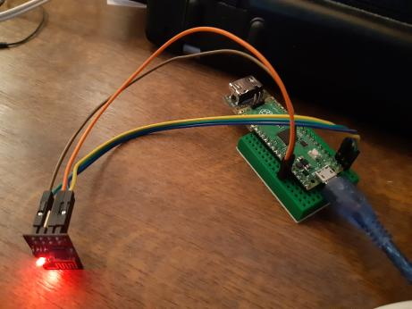
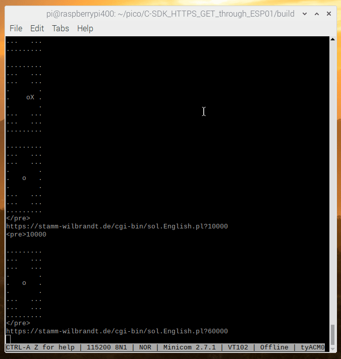

# C-SDK HTTPS GET through ESP01 Wifi

Let Pico do C-SDK HTTPS (internet) GET requests through serially connected ESP01 Wifi.

In case you are interested in this with Pico Micropython, find solution here:  
[https://www.raspberrypi.org/forums/viewtopic.php?f=146&t=307704](https://www.raspberrypi.org/forums/viewtopic.php?f=146&t=307704)

## Build
```
mkdir build
cd build
cmake ..
make
```

Then flash C-SDK_HTTPS_GET_through_ESP01.uf2 onto Pico.

Flash SerialHttpsClient.ino Arduino sketch onto ESP01:  
[https://gist.github.com/Hermann-SW/e945a78e8a460a5335058bc679f48b03](https://gist.github.com/Hermann-SW/e945a78e8a460a5335058bc679f48b03)  
( [How to install Arduino IDE ESP8266 support](https://github.com/esp8266/Arduino#contents) )

## Setup
Just connect Pico 3V3/GND/GP0/GP1/3V3 to ESP01 3V3/GND/RX/TX/EN.  


## Demo

"void https_get(char \*url)" writes a '\n' terminated HTTPS URL to ESP01 over serial interface.  
ESP01 requests that URL via Wifi, and returns the response over serial to Pico.  
Pico just prints the HTTP url and the received response over USB into eg. minicom session.

See [C-SDK_HTTPS_GET_through_ESP01.c](C-SDK_HTTPS_GET_through_ESP01.c) for details:  
*  "stdio_filter_driver(&stdio_usb)" restricts stdio to Pico USB interface
*  "uart_*()" functions handle serial communication with ESP01

Screen recording of minicom USB session ("minicom -b 115200 -o -D /dev/ttyACM0"):  

